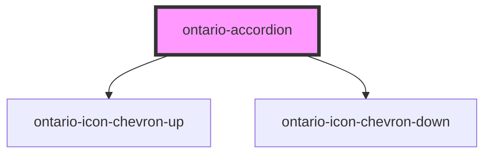

import { OntarioAccordion } from '@ontario-lrc/ontario-design-system-component-library-react';

# ontario-accordion

Use accordions to provide a show/hide option for sections of content on complex pages.

## Usage guidance

Please refer to the [Ontario Design System](https://designsystem.ontario.ca/components/detail/accordions.html) for current documentation guidance for accordions.

## Configuration

Once the component package has been installed (see Ontario Design System Component Library for installation instructions), the accordion component can be added directly into the project's code, and can be customized by updating the properties outlined [here](#properties). Please see the [examples](#examples) below for how to configure the component.

## Examples

Example of an accordion component, where the user is explicitly passing in content through the `accordionData` property.

```html
<ontario-accordion
	title="My Accordion"
	expand-collapse-button='{
		"expandAllSectionsLabel": "Expand All",
		"collapseAllSectionsLabel": "Collapse All"
	}'
	accordion-data='[
	    {"label": "Accordion 1", "content": "This is a string"},
		{"label": "Accordion 2", "accordionContentType": "html", "content": "<ul><li>List A</li><li>List B</li><li>List C</li></ul>"}
	]'
></ontario-accordion>
```

<div>
	<OntarioAccordion
		title="My Accordion"
		expand-collapse-button='{
			"expandAllSectionsLabel": "Expand All",
			"collapseAllSectionsLabel": "Collapse All"
		}'
		accordion-data='[
			{"label": "Accordion 1", "content": "This is a string"},
			{"label": "Accordion 2", "accordionContentType": "html", "content": "<ul><li>List A</li><li>List B</li><li>List C</li></ul>"}
		]'
	></OntarioAccordion>
</div>

## Custom property types

### Accordion

```ts
accordion-data='[ {"label": "Accordion 1", "content": "Text Context"}, {"label": "Accordion 2", "content": "Text Content"}]'
```

| Property               | Description                                                                                                                                   | Type                 | Default  |
| ---------------------- | --------------------------------------------------------------------------------------------------------------------------------------------- | -------------------- | -------- |
| `label`                | The label for the individual accordion button.                                                                                                | `string`             |          |
| `accordionContentType` | The content type of the accordion. If the accordion requires multiple lines or HTML, the `accordionContentType` prop should be set to `html`. | `'string' \| 'html'` | `string` |
| `content`              | The content that is passed into each accordion.                                                                                               | `string`             |
| `isOpen`               | A boolean to track whether the accordion is expanded or collapsed.                                                                            | `string`             |
| `ariaLabelText`        | Custom Aria Label text for the section.                                                                                                       | `string`             |

### ExpandCollapseButtonDetails

By default, the component uses our recommended values for the Expand/Collapse button label, which will automatically match the language the component is in. However, if custom values for this button are required they can be set via the `expandCollapseButton` property.

```ts
expand-collapse-button='{ "expandAllSectionsLabel": "Expand All", "collapseAllSectionsLabel": "Collapse All" }'
```

| Property                   | Description                              | Type     |
| -------------------------- | ---------------------------------------- | -------- |
| `expandAllSectionsLabel`   | The label for the 'Expand all' button.   | `string` |
| `collapseAllSectionsLabel` | The label for the 'Collapse all' button. | `string` |
| `ariaLabelText`            | Alt text for the expand/close button.    | `string` |

<!-- Auto Generated Below -->

## Properties

| Property               | Attribute                | Description                                                                                                                                                                                                                                                                    | Type                                                 | Default     |
| ---------------------- | ------------------------ | ------------------------------------------------------------------------------------------------------------------------------------------------------------------------------------------------------------------------------------------------------------------------------ | ---------------------------------------------------- | ----------- |
| `accordionData`        | `accordion-data`         | Used to include individual accordion data for the accordion component. This is passed in as an array of objects with key-value pairs. The `content` is expecting a string, that can either be written as HTML or a just a plain string, depending on the accordionContentType. | `Accordion[] \| string`                              | `undefined` |
| `expandCollapseButton` | `expand-collapse-button` | Custom Expand/Collapse button text.                                                                                                                                                                                                                                            | `ExpandCollapseButtonDetails \| string \| undefined` | `undefined` |
| `isOpen`               | `is-open`                | Used to show whether the accordion is opened or closed.                                                                                                                                                                                                                        | `boolean`                                            | `false`     |
| `language`             | `language`               | The language of the component. This is used for translations, and is by default set through event listeners checking for a language property from the header. If none are passed, it will default to English.                                                                  | `"en" \| "fr" \| undefined`                          | `undefined` |
| `name`                 | `name`                   | The name of the accordion component. This is not optional.                                                                                                                                                                                                                     | `string`                                             | `undefined` |

## Dependencies

### Depends on

- [ontario-icon-chevron-up](../ontario-icon)
- [ontario-icon-chevron-down](../ontario-icon)

### Graph



---

_Built with [StencilJS](https://stenciljs.com/)_
