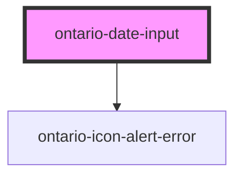

import { OntarioDateInput } from '@ontario-lrc/ontario-design-system-component-library-react';

# ontario-date-input

Use this component for user-friendly date input and display.

## Usage guidance

Please refer to the [Ontario Design System](https://designsystem.ontario.ca/components/detail/dates.html) for current documentation guidance.

## Configuration

Once the component package has been installed (see Ontario Design System Component Library for installation instructions), the date input component can be added directly into the project's code, and can be customized by updating the properties outlined [here](#properties). Additional information on custom types for the date input properties are outlined [here](#custom-property-types). Please see the [examples](#examples) below for how to configure the component.

## Examples

Example of date input component

```html
<ontario-date-input
	placeholder='{
		"day": "DD",
		"month": "MM",
		"year": "YYYY"
	}'
	min-year="500"
	max-year="1000"
	required="true"
	date-options='["day", "month", "year"]'
	hint-text="For example 2000 03 01"
	caption='{
		"captionText": "Exact Date",
		"captionType": "default"
	}'
></ontario-date-input>
```

<div>
	<OntarioDateInput
		placeholder='{
			"day": "DD",
			"month": "MM",
			"year": "YYYY"
		}'
		min-year="500"
		max-year="1000"
		required="true"
		date-options='["day", "month", "year"]'
		hint-text="For example 2000 03 01"
		caption='{
			"captionText": "Exact Date",
			"captionType": "default"
		}'
	></OntarioDateInput>
</div>

Example of passing custom date validation function to modify validation logic or providing custom error strings.

```html
<ontario-date-input></ontario-date-input>

<script>
	function handleDateValidation(day, month, year) {
		let error = '';
		let dayInvalid = false;
		let monthInvalid = false;
		let yearInvalid = false;

		if (day <= 0) {
			dayInvalid = true;
		}

		if (month <= 0) {
			monthInvalid = true;
		}

		if (year <= 0) {
			yearInvalid = true;
		}

		if (dayInvalid || monthInvalid || yearInvalid) {
			error = 'Invalid date.';
		}

		// add more logic here

		return { errorMessage: error, dayInvalid, monthInvalid, yearInvalid };
	}

	document.querySelector('ontario-date-input').dateValidator = handleDateValidation;
</script>
```

### Forms

The `ontario-date-input` supports integration with native HTML `<form>` elements. This element integrates with the underlying browser form API.

The `ontario-date-input` returns an [ISO 8601](https://en.wikipedia.org/wiki/ISO_8601) formatted date with a time component of `00:00:00Z`, or midnight UTC, eg. `2024-02-20T00:00:00.000Z`, combining the _year_, _month_, and _day_ fields together. _It has to be noted that the input only supports numerical values within any of the fields._

```html
<form>
	<!-- Add an ontario-date-input -->
	<ontario-date-input
		element-id="date-input-1"
		name="date-input-1"
		placeholder='{
			"day": "DD",
			"month": "MM",
			"year": "YYYY"
		}'
		min-year="999"
		max-year="9999"
		required
		date-options='["day", "month", "year"]'
		hint-text="For example 2000 03 01"
		caption="Enter a date"
	></ontario-date-input>

	<!-- Submit the form with a submit button -->
	<ontario-button type="primary" html-type="submit">Submit</ontario-button>
</form>
```

Remember to set the `name` attribute as this is used to identify the field when submitting the form.

## Custom property types

### DateValidatorReturnType

The `dateValidator` function returns `DateValidatorReturnType` for custom date input validation. Below is example of dateValidator function.

```html
<script>
	function handleDateValidation(day, month, year) {
		return {
			errorMessage: 'Invalid Error',
			dayInvalid: true,
			monthInvalid: false,
			yearInvalid: false,
		};
	}
</script>
```

| Property       | Type      | Description                                | Required |
| -------------- | --------- | ------------------------------------------ | -------- |
| `errorMessage` | `string`  | Error message to display for invalid date. | NO       |
| `dayInvalid`   | `boolean` | Indicate if day is invalid                 | YES      |
| `monthInvalid` | `boolean` | Indicate if month is invalid               | YES      |
| `yearInvalid`  | `boolean` | Indicate if year is invalid                | YES      |

### caption

The `caption` property is used to render the label for the ontario-input. It can be passed either a string or an object. If no `captionType` needs to be specified, it can be passed as a string.

```html
caption='{ "captionText": "Exact Date", "captionType": "heading" }'
```

<!-- Auto Generated Below -->

## Properties

| Property        | Attribute      | Description                                                                                                                                                                                                                                                                                                       | Type                                                                                                             | Default                    |
| --------------- | -------------- | ----------------------------------------------------------------------------------------------------------------------------------------------------------------------------------------------------------------------------------------------------------------------------------------------------------------- | ---------------------------------------------------------------------------------------------------------------- | -------------------------- |
| `caption`       | `caption`      | The text to display as the input label                                                                                                                                                                                                                                                                            | `Caption \| string`                                                                                              | `undefined`                |
| `dateOptions`   | `date-options` | An array value used to display date options. For example, only the day and month fields can be displayed by specifying the dateOptions as `["day", "month"]`, etc. This is optional. If no prop for `dateOptions` is passed, it will default to `["day", "month", "year"]`.                                       | `DateInputFieldType[] \| string \| undefined`                                                                    | `['day', 'month', 'year']` |
| `dateValidator` | --             | A function used to override internal date validation logic, which takes three arguments (i.e day, month and year) and returns an object of type `DateValidatorReturnType` This is optional. If no prop for `dateValidator` is passed, it will default to internal validation function to validate the date input. | `((day: string, month: string, year: string) => DateValidatorReturnType) \| undefined`                           | `undefined`                |
| `elementId`     | `element-id`   | The unique identifier of the input. This is optional - if no ID is passed, one will be generated.                                                                                                                                                                                                                 | `string \| undefined`                                                                                            | `undefined`                |
| `hintText`      | `hint-text`    | Used to include the ontario-hint-text component for the date input group. This is optional.                                                                                                                                                                                                                       | `string \| undefined`                                                                                            | `undefined`                |
| `language`      | `language`     | The language of the component. This is used for translations, and is by default set through event listeners checking for a language property from the header. If none are passed, it will default to English.                                                                                                     | `"en" \| "fr" \| undefined`                                                                                      | `undefined`                |
| `maxYear`       | `max-year`     | A number value indicating maximum value allowed for year input field of the date component. This is optional. If no prop is passed, it will default to `9999`.                                                                                                                                                    | `number \| undefined`                                                                                            | `undefined`                |
| `minYear`       | `min-year`     | A number value indicating minimum value allowed for year input field of the date component. This is optional. If no prop is passed, it will default to `999`.                                                                                                                                                     | `number \| undefined`                                                                                            | `undefined`                |
| `placeholder`   | `placeholder`  | An object value used to set the placeholder text for the day, month and year input fields. Any combination of the three input fields (i.e day, month, year) of the date component can be overridden. This is optional. If no prop is passed, it will not display any placeholder text.                            | `string \| undefined \| { day?: string \| undefined; month?: string \| undefined; year?: string \| undefined; }` | `undefined`                |
| `required`      | `required`     | A boolean value to determine whether or not the date input is required. This is optional. If no prop is passed, it will default to `false`.                                                                                                                                                                       | `boolean \| undefined`                                                                                           | `false`                    |

## Events

| Event                | Description                                                                | Type                                                                     |
| -------------------- | -------------------------------------------------------------------------- | ------------------------------------------------------------------------ |
| `inputErrorOccurred` | Emitted when an error message is reported to the component.                | `CustomEvent<{ inputId: string; errorMessage: string; }>`                |
| `inputOnBlur`        | Emitted when a keyboard input event occurs when an input has lost focus.   | `CustomEvent<"day" \| "month" \| "year">`                                |
| `inputOnChange`      | Emitted when a `change` event occurs within the component.                 | `CustomEvent<{ value: string; fieldType: "day" \| "month" \| "year"; }>` |
| `inputOnFocus`       | Emitted when a keyboard input event occurs when an input has gained focus. | `CustomEvent<"day" \| "month" \| "year">`                                |
| `inputOnInput`       | Emitted when an `input` event occurs within the component.                 | `CustomEvent<{ value: string; fieldType: "day" \| "month" \| "year"; }>` |

## Dependencies

### Depends on

- [ontario-icon-alert-error](../ontario-icon)

### Graph



---

_Built with [StencilJS](https://stenciljs.com/)_
