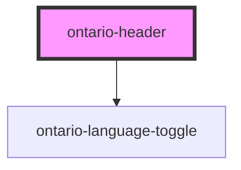

import { OntarioHeader } from '@ontario-lrc/ontario-design-system-component-library-react';
import useBaseUrl from '@docusaurus/useBaseUrl';

# ontario-header

Use the `ontario` type header for all pages that are part of the main ontario.ca website. This header is mandatory.

Use the `applicaton` type header for applications and subsites outside of the main ontario.ca website.

Use the `serviceOntario` type header for ServiceOntario sites/apps. This type is for use by ServiceOntario teams only.

## Usage guidance

Please refer to the [Ontario Design System Ontario.ca header](https://designsystem.ontario.ca/components/detail/ontario-header.html) for current documentation guidance for the Ontario.ca header.

Please refer to the [Ontario Design System Application header](https://designsystem.ontario.ca/components/detail/application-header.html) for current documentation guidance for the Application header.

Please refer to the [Ontario Design System ServiceOntario header](https://designsystem.ontario.ca/components/detail/service-ontario-header.html) for current documentation guidance for the ServiceOntario header.

## Configuration

Once the component package has been installed (see Ontario Design System Component Library for installation instructions), the header component can be added directly into the project's code, and can be customized by updating the properties outlined [here](#properties). Additional information on custom types for header properties are outlined [here](#custom-property-types). Please see the [examples](#examples) below for how to configure the component.

## Examples

Example of an Ontario.ca header component.

```html
<ontario-header
	type="ontario"
	language-toggle-options='{
		"englishLink": "/driving-and-roads",
		"frenchLink" : "/fr/conduite-et-routes"
	}'
	menu-items='[
		{
			"title": "Arts and Culture",
			"href": "https://www.ontario.ca/page/arts-and-culture",
			"linkIsActive": "false"
		},
		{
			"title": "Business and economy",
			"href": "https://www.ontario.ca/page/business-and-economy",
			"linkIsActive": "false"
		},
		{
			"title": "Driving and Roads",
			"href": "https://www.ontario.ca/page/driving-and-roads",
			"linkIsActive": "false"
		},
		{
			"title": "Education and training",
			"href": "https://www.ontario.ca/page/education-and-training",
			"linkIsActive": "false"
		},
		{
			"title": "Environment and energy",
			"href": "https://www.ontario.ca/page/environment-and-energy",
			"linkIsActive": "false"
		},
		{
			"title": "Government",
			"href": "https://www.ontario.ca/page/government",
			"linkIsActive": "false"
		},
		{
			"title": "Health and wellness",
			"href": "https://www.ontario.ca/page/health-care-ontario",
			"linkIsActive": "false"
		},
		{
			"title": "Home and community",
			"href": "https://www.ontario.ca/page/home-and-community",
			"linkIsActive": "false"
		},
		{
			"title": "Jobs and employment",
			"href": "https://www.ontario.ca/page/jobs-and-employment",
			"linkIsActive": "false"
		},
		{
			"title": "Law and safety",
			"href": "https://www.ontario.ca/page/law-and-safety",
			"linkIsActive": "false"
		},
		{
			"title": "Rural and north",
			"href": "https://www.ontario.ca/page/rural-and-north",
			"linkIsActive": "false"
		},
		{
			"title": "Taxes and benefits",
			"href": "https://www.ontario.ca/page/taxes-and-benefits",
			"linkIsActive": "false"
		},
		{
			"title": "Travel and recreation",
			"href": "https://www.ontario.ca/page/travel-and-recreation",
			"linkIsActive": "false"
		}
	]'
>
</ontario-header>
```

<div>
	<OntarioHeader
		asset-base-path={useBaseUrl('/assets')}
		type="application"
		disable-dynamic-menu="true"
		application-header-info='{
		"title": "Driving and roads",
		"href": "/driving-and-roads",
		"maxSubheaderDesktopLinks": "3",
		"maxSubheaderTabletLinks": "1"
		}'
		language-toggle-options='{
		"englishLink": "/",
		"frenchLink" : "/fr"
		}'
		menu-items='[
		{
		"title": "Vehicle registration",
		"href": "/vehicle-registration",
		"linkIsActive": "false"
		},
		{
		"title": "Driver records",
		"href": "/driver-records",
		"linkIsActive": "false"
		},
		{
		"title": "Accessible Parking Permits",
		"href": "/accessible-parking-permits",
		"linkIsActive": "false"
		},
		{
		"title": "Highway traveler information",
		"href": "/highway-traveler-information",
		"linkIsActive": "true",
		"onClickHandler": (e: Event) => {
		e.preventDefault();
		alert("Menu item clicked!")
		},
		}
		]'
		custom-language-toggle="{changeLanguage}">
	 </OntarioHeader>
</div>

Example of an Application header component.

```html
<ontario-header
	type="application"
	disable-dynamic-menu="true"
	application-header-info='{
		"title": "Driving and roads",
		"href": "/driving-and-roads",
		"maxSubheaderDesktopLinks": "3",
		"maxSubheaderTabletLinks": "1"
	}'
	language-toggle-options='{
		"englishLink": "/",
		"frenchLink" : "/fr"
	}'
	menu-items='[
		{
			"title": "Vehicle registration",
			"href": "/vehicle-registration",
			"linkIsActive": "false"
		},
		{
			"title": "Driver records",
			"href": "/driver-records",
			"linkIsActive": "false"
		},
		{
			"title": "Accessible Parking Permits",
			"href": "/accessible-parking-permits",
			"linkIsActive": "false"
		},
		{
			"title": "Highway traveler information",
			"href": "/highway-traveler-information",
			"linkIsActive": "true",
			"onClickHandler": (e: Event) => {
					e.preventDefault();
					alert("Menu item clicked!")
			},
		}
	]'
	custom-language-toggle="{changeLanguage}"
>
</ontario-header>

<script>
	const changeLanguage = (e: Event) => {
		e.preventDefault();
		// Logic to change language below
	};
</script>
```

## Custom property types

### languageToggleOptions

```html
language-toggle-options='{ "englishLink": "/en", "frenchLink": "/fr" }'
```

| **Property name** | **Type** | **Description**                   |
| ----------------- | -------- | --------------------------------- |
| `englishLink`     | `string` | The URL link for the English page |
| `frenchLink`      | `string` | The URL link for the French page  |

### menuItems

For the Ontario.ca header, the menu items will automatically be rendered in a dropdown menu button.

For Application headers, there is a default of a maximum of 5 menu links on desktop and 2 menu links on tablet displayed in the subheader. This logic is handled by the web component based on the total number of menu links passed.

```html
<ontario-header
	menu-items='[
		{
			"title": "Vehicle registration",
			"href": "/vehicle-registration",
			"linkIsActive": "false"
		},
		{
			"title": "Driver records",
			"href": "/driver-records",
			"linkIsActive": "false"
		},
		{
			"title": "Accessible Parking Permits",
			"href": "/accessible-parking-permits",
			"linkIsActive": "false"
		},
		{
			"title": "Highway traveler information",
			"href": "/highway-traveler-information",
			"linkIsActive": "true",
			"onClickHandler": (e: Event) => { e.preventDefault(); alert("Menu item clicked!") }
		}
	]'
></ontario-header>
```

| **Property name** | **Type**                 | **Description**                                                                                                                                     |
| ----------------- | ------------------------ | --------------------------------------------------------------------------------------------------------------------------------------------------- |
| `title`           | `string`                 | The title of the menu item (this is what will appear as the label in the header/dropdown menu)                                                      |
| `href`            | `string`                 | The URL for the menu item                                                                                                                           |
| `linkIsActive`    | `boolean`                | A boolean flag for whether or not the current menu item link is active. If set to true, active classes and styles will be applied to the menu item. |
| `onClickHandler`  | `(event: Event) => void` | An optional custom function to add to the menu item. This can be used if any additional logic should happen when the menu item is clicked.          |

### applicationHeaderInfo

Note that this is only required for the Application and ServiceOntario header types.

```html
application-header-info='{ "title": "Application name", "href": "/", "maxSubheaderDesktopLinks": "4",
"maxSubheaderTabletLinks": "2", "maxSubheaderMobileLinks": "1" }'
```

| **Property name**          | **Type** | **Description**                                                                                                                                                                                                                                                                                                                                                                                                                                                                                                                                  |
| -------------------------- | -------- | ------------------------------------------------------------------------------------------------------------------------------------------------------------------------------------------------------------------------------------------------------------------------------------------------------------------------------------------------------------------------------------------------------------------------------------------------------------------------------------------------------------------------------------------------ |
| `title`                    | `string` | The title of the application (this is what will appear as the label for the application sub header title)                                                                                                                                                                                                                                                                                                                                                                                                                                        |
| `href`                     | `string` | The URL for the application name                                                                                                                                                                                                                                                                                                                                                                                                                                                                                                                 |
| `maxSubheaderDesktopLinks` | `number` | The number of links to appear in the Ontario application type header's subheader on desktop size. This is optional.<br /><br /> These links will display in the order they are described in the `menuItems` prop. For example, if the `maxSubheaderDesktopLinks` number is '4', the first four `menuItems` items will appear in the application subheader on desktop, and the rest will appear in the menu dropdown.<br /><br /> If no dropdown item is needed, the `maxSubheaderDesktopLinks` number should match the `menuItems` items length. |
| `maxSubheaderTabletLinks`  | `number` | The number of links to appear in the Ontario application type header's subheader on tablet size. This is optional.<br />< br /> These links will display in the order they are described in the `menuItems` prop. For example, if the `maxSubheaderTabletLinks` number is '2', the first two `menuItems` items will appear in the application subheader on tablet, and the rest will appear in the menu dropdown.<br /><br /> If no dropdown item is needed, the `maxSubheaderTabletLinks` number should match the `menuItems` items length.     |
| `maxSubheaderMobileLinks`  | `number` | The number of links to appear in the Ontario application type header's subheader on mobile size. This is optional.<br /><br /> These links will display in the order they are described in the `menuItems` prop. For example, if the `maxSubheaderMobileLinks` number is '1', the first `menuItems` item will appear in the application subheader on mobile, and the rest will appear in the menu dropdown.<br /><br /> If no dropdown item is needed, the `maxSubheaderMobileLinks` number should match the `menuItems` items length.           |

## Accessibility

### Application header

To ensure best practices, it is important to limit the number of navigation links passed to the `menuItems` property. We recommend a maximum of seven links, and to keep the labels for these links concise.

<!-- Auto Generated Below -->

## Properties

| Property                | Attribute                 | Description                                                                                                                                                                                                                                            | Type                                                          | Default         |
| ----------------------- | ------------------------- | ------------------------------------------------------------------------------------------------------------------------------------------------------------------------------------------------------------------------------------------------------ | ------------------------------------------------------------- | --------------- |
| `applicationHeaderInfo` | `application-header-info` | Information pertaining to the application header. This is only necessary for the 'application' header type. This includes the application name, URL and optional props for the number of links in the subheader for desktop, tablet, and mobile views. | `ApplicationHeaderInfo \| string`                             | `undefined`     |
| `assetBasePath`         | `asset-base-path`         | The base path to an assets folder containing the Design System assets                                                                                                                                                                                  | `string`                                                      | `undefined`     |
| `customLanguageToggle`  | --                        | A custom function to pass to the language toggle button.                                                                                                                                                                                               | `((event: Event) => void) \| undefined`                       | `undefined`     |
| `disableDynamicMenu`    | `disable-dynamic-menu`    | Option to disable fetching of the dynamic menu from the Ontario Header API                                                                                                                                                                             | `boolean`                                                     | `false`         |
| `language`              | `language`                | The language of the component. This is used for translations, and is by default set through event listeners checking for a language property from the header. If none is passed, it will default to English.                                           | `"en" \| "fr" \| undefined`                                   | `'en'`          |
| `languageToggleOptions` | `language-toggle-options` | Information pertaining to the language toggle links.                                                                                                                                                                                                   | `LanguageToggleOptions \| string \| undefined`                | `undefined`     |
| `menuItems`             | `menu-items`              | The items that will go inside the menu.                                                                                                                                                                                                                | `MenuItem[] \| string`                                        | `undefined`     |
| `type`                  | `type`                    | The type of header.                                                                                                                                                                                                                                    | `"application" \| "ontario" \| "serviceOntario" \| undefined` | `'application'` |

## Dependencies

### Depends on

- [ontario-language-toggle](../ontario-language-toggle)

### Graph



---

_Built with [StencilJS](https://stenciljs.com/)_
