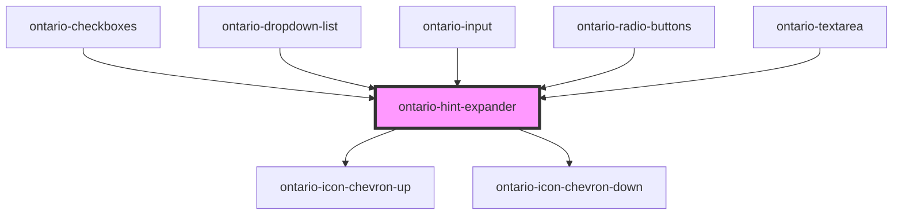

# ontario-hint-expander

Use a hint expander when:

- the hint text is long and **won’t be needed by the majority of users**
- you want to give the user the option to see a **helpful image**, such as a picture of a driver’s licence showing where to find the licence number

## Usage guidance

Please refer to the [Ontario Design System](https://designsystem.ontario.ca/components/detail/hint-text.html) for current documentation guidance.

## Configuration

Once the component package has been installed (see Ontario Design System Component Library for installation instructions), the hint expander component can be added directly into the project's code, and can be customized by updating the properties outlined [here](#properties). Please see the [examples](#examples) below for how to configure the component.

## Examples

Example of a bare-bones hint expander component where the user is passing the `hint` that will be displayed as the question/statement. The`content` is what is displayed once the hint expander is expanded.

```html
<ontario-hint-expander hint="This is the hint" content="This is the content"></ontario-hint-expander>
```

Example of a hint expander that includes an `element-id` property - this is used to establish a relationship between hint text content and elements using the `aria-describedby` attribute.

```html
<ontario-hint-expander
	hint="This is the hint"
	content="This is the content"
	element-id="expander-82913`"
></ontario-hint-expander>
```

## Accessibility

### Usage

In order for hint expanders to have meaningful sequence, they should be added after the associated form element so the user can understand the context of the information.

Since the hint expander information comes after the form element, add text in the associated label (only visible to screen readers) to let the user know there is additional context below.

#### Example:

```html
<legend class="ontario-fieldset__legend">
	{this.legend}
	<span class="ontario-label__flag"> {this.isRequired ? "(required)" : "(optional)"} </span>
	<span class="ontario-show-for-sr">More information on (label name) is available in the next element</span>
</legend>
```

<!-- Auto Generated Below -->

## Properties

| Property          | Attribute           | Description                                                                                                                                                                                                                                     | Type                              | Default     |
| ----------------- | ------------------- | ----------------------------------------------------------------------------------------------------------------------------------------------------------------------------------------------------------------------------------------------- | --------------------------------- | ----------- |
| `content`         | `content`           | Content to display as the hint, once the expander is toggled open. Please note that any content that is passed into this prop will only be displayed as a string. If you would like to add HTML content, supply child content to the component. | `string`                          | `undefined` |
| `elementId`       | `element-id`        | Used to used to establish a relationship between hint text content and elements using aria-describedby. This is optional - if no ID is passed, one will be generated.                                                                           | `string \| undefined`             | `undefined` |
| `hint`            | `hint`              | Text to display as the hint expander question/statement                                                                                                                                                                                         | `string`                          | `undefined` |
| `hintContentType` | `hint-content-type` | The content type of the hint. If no prop is passed, it will default to a string. If the hint requires multiple lines or HTML, the `hintContentType` prop should be set to `html`.                                                               | `"html" \| "string" \| undefined` | `'string'`  |

## Events

| Event                 | Description                                          | Type               |
| --------------------- | ---------------------------------------------------- | ------------------ |
| `toggleExpanderEvent` | Emitted when a keyboard input or mouse event occurs. | `CustomEvent<any>` |

## Dependencies

### Used by

- [ontario-checkboxes](../ontario-checkbox)
- [ontario-dropdown-list](../ontario-dropdown-list)
- [ontario-input](../ontario-input)
- [ontario-radio-buttons](../ontario-radio-buttons)
- [ontario-textarea](../ontario-textarea)

### Depends on

- [ontario-icon-chevron-up](../ontario-icon)
- [ontario-icon-chevron-down](../ontario-icon)

### Graph



---

_Built with [StencilJS](https://stenciljs.com/)_
