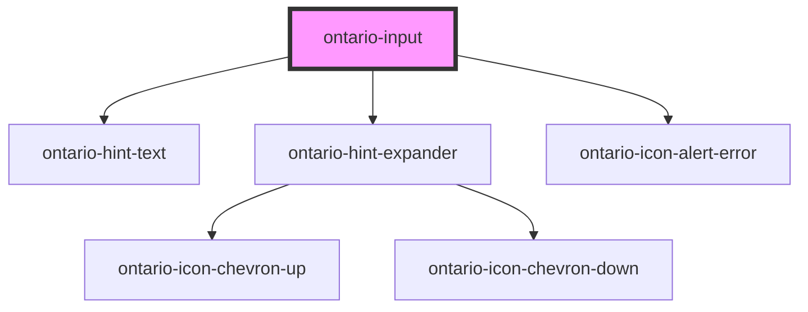

import { OntarioInput } from '@ontario-lrc/ontario-design-system-component-library-react';

# ontario-input

Use a text input when you want the user to enter no more than a single line of information.

## Usage guidance

Please refer to the [Ontario Design System](https://designsystem.ontario.ca/components/detail/text-inputs.html) for current documentation guidance.

## Configuration

Once the component package has been installed (see Ontario Design System Component Library for installation instructions), the input component can be added directly into the project's code, and can be customized by updating the properties outlined [here](#properties). Additional information on custom types for header properties are outlined [here](#custom-property-types). Please see the [examples](#examples) below for how to configure the component.

## Examples

Example of a bare-bones input component, the `name` property is passed in for the input, which is used to reference form data after a form is submitted. The `caption` property is being provided, which will be displayed as the label. By default, the `inputWidth` will be `default`, the `type` will be `text`, and the input will be set to `optional`.

```html
<ontario-input name="ontario-text-input" caption="Ontario input"></ontario-input>
```

<OntarioInput name="ontario-text-input" caption="Ontario input"></OntarioInput>

The following input component example has the `inputWidth` property passed in, which will define the width of the input field.

```html
<ontario-input
	name="ontario-text-input"
	caption='{
		"captionText": "Ontario input",
		"captionType": "large"
	}'
	input-width="10-char-width"
></ontario-input>
```

<div>
	<OntarioInput
		name="ontario-text-input"
		caption='{
			"captionText": "Ontario input",
			"captionType": "large"
		}'
		input-width="10-char-width">
	</OntarioInput>
</div>

### Forms

The `ontario-input` supports integration with native HTML `<form>` elements. This element integrates with the underlying browser form API and should work the same as an `<input type="text">`.

```html
<form>
	<!-- Add an ontario-input -->
	<ontario-input
		id="input-1"
		caption="What is your name?"
		required
		name="input-1"
		hint-text="Enter your full name"
	></ontario-input>

	<!-- Submit the form with a submit button -->
	<ontario-button type="primary" html-type="submit">Submit</ontario-button>
</form>
```

Remember to set the `name` attribute as this is used to identify the field when submitting the form.

## Error messaging

### Setting an error message

An error message can be displayed on an input by setting the `errorMessage` property. This will display a message to the user along with broadcasting an event, called `inputErrorOccurred`, that can be listened for by other components or custom event handlers.

```html
<ontario-input id="input-1" name="input-1" caption="What is your name?" required></ontario-input>
<script>
	// Note: this waits for the page and components to load before
	// locating the component.
	window.onload = () => {
		const input1 = document.getElementById('input-1');
		input1.addEventListener('inputErrorOccurred', (event) => {
			console.log('errorMessage:', event.details.errorMessage);
		});
	};
</script>
```

_Note: to test the above code sample either set an `errorMessage` on `input-1` or add the `enable-live-validation` attribute._

### Input live validation

By setting the `enableLiveValidation` property the value of an input can be validated by using the custom `inputValidator` function. This function notifies the component if there is an error based on the custom logic that fits your application. On the `blur` event of the component, it will pass over the `value` of the input and if an `errorMessage` is returned it will instruct the component to display it. To clear the error message displayed return `undefined` or `null`.

For example, in HTML a script can be added to validate if the user has entered the word _error_ in to the input.

```html
<ontario-input id="input-1" name="input-1" caption="What is your name?" required enable-live-validation></ontario-input>
<script>
	// Note: this waits for the page and components to load before
	// locating the component.
	window.onload = () => {
		const input1 = document.getElementById('input-1');
		input1.inputValidator = async (value) => {
			if (value === 'error') return { errorMessage: "You entered 'error'" };
		};
	};
</script>
```

#### Required validation

`OntarioInput`s that are labelled as `required` will have validation performed on them to make sure they are filled out. Validation on the input is performed in the following order:

1. `inputValidator` is called to perform custom validation, then if there are no errors,
2. the required check is performed.

_If the field has been interacted with and there is no `value` present then an error message will be displayed._

##### Required validation error message

Our best practices insist that a contextual based error message be provided to the user should an error occur. For required fields the `requiredValidationMessage` property can be used to set the message that is displayed should the required check fail, ie. if a required field has been interacted with but the information has been deleted from it this message will prompt the user that the field is required.

For example,

```html
<ontario-input
	id="first-name"
	name="first-name"
	caption="First Name"
	required
	enable-live-validation
	required-validation-message="Enter your first name"
></ontario-input>
```

<div>
	<OntarioInput
		id="first-name"
		name="first-name"
		caption="First Name"
		required
		enable-live-validation
		required-validation-message="Enter your first name">
	</OntarioInput>
</div>

### Learn more

Error messaging best practices are based off the Ontario Design System [Error messaging guidance](https://designsystem.ontario.ca/components/detail/error-messaging.html).

Visit the [Live validation](https://designsystem.ontario.ca/components/detail/error-messaging.html) guidance page for more information about live validation.

## Custom property types

### caption

The `caption` property is used to render the label for the ontario-input. It can be passed either a string or an object. If no `captionType` needs to be specified, it can be passed as a string.

```html
caption='{ "captionText": "Input label", "captionType": "large" }'
```

| Property name | Type                               | Description                                                                                                                                      |
| ------------- | ---------------------------------- | ------------------------------------------------------------------------------------------------------------------------------------------------ |
| `captionText` | `string`                           | Text to display as the input question                                                                                                            |
| `captionType` | `"default" \| "large"\| "heading"` | The type of label to display for the input question. This is optional, and if no information is provided, it will default to the `default` type. |

### hintExpander

The `hintExpander` property is used to include the Hint Expander component underneath the input label. This is passed in as an object with key-value pairs.

```html
hintExpander='{ "hint": "This is the hint expander title", "content": "This is the hint expander content - it is only
visible when the hint expander title (hint) is toggled" }'
```

| Property name | Type     | Description                                                                                                     |
| ------------- | -------- | --------------------------------------------------------------------------------------------------------------- |
| `hint`        | `string` | Text to display as the hint expander label/title. When toggled, it will display/hide the `hintExpander` content |
| `content`     | `string` | Text to display as the content of the hint expander                                                             |

## Accessibility

An `element-id` attribute is necessary to allow the input to be associated with a label element

A `name` attribute needs to be set to be submitted to the server when the form is submitted.

<!-- Auto Generated Below -->

## Properties

| Property                    | Attribute                     | Description                                                                                                                                                                                                                                                                                                                                 | Type                                                                                                                                        | Default     |
| --------------------------- | ----------------------------- | ------------------------------------------------------------------------------------------------------------------------------------------------------------------------------------------------------------------------------------------------------------------------------------------------------------------------------------------- | ------------------------------------------------------------------------------------------------------------------------------------------- | ----------- |
| `caption`                   | `caption`                     | The text to display as the input label                                                                                                                                                                                                                                                                                                      | `Caption \| string`                                                                                                                         | `undefined` |
| `customOnBlur`              | --                            | Used to add a custom function to the input onBlur event.                                                                                                                                                                                                                                                                                    | `((event: Event) => void) \| undefined`                                                                                                     | `undefined` |
| `customOnChange`            | --                            | Used to add a custom function to the input onChange event.                                                                                                                                                                                                                                                                                  | `((event: Event) => void) \| undefined`                                                                                                     | `undefined` |
| `customOnFocus`             | --                            | Used to add a custom function to the input onFocus event.                                                                                                                                                                                                                                                                                   | `((event: Event) => void) \| undefined`                                                                                                     | `undefined` |
| `customOnInput`             | --                            | Used to add a custom function to the input onInput event.                                                                                                                                                                                                                                                                                   | `((event: Event) => void) \| undefined`                                                                                                     | `undefined` |
| `elementId`                 | `element-id`                  | The unique identifier of the input. This is optional - if no ID is passed, one will be generated.                                                                                                                                                                                                                                           | `string \| undefined`                                                                                                                       | `undefined` |
| `enableLiveValidation`      | `enable-live-validation`      | Enable live validation on the input. Custom live validation can be performed using an `inputValidator` validation function. It will also validate the `required` state if no errors are returned from the `inputValidator`. Please set a `requiredValidationMessage` to report concisely to the end user what they are required to set.     | `boolean`                                                                                                                                   | `false`     |
| `errorMessage`              | `error-message`               | Set this to display an                                                                                                                                                                                                                                                                                                                      | `string \| undefined`                                                                                                                       | `undefined` |
| `hintExpander`              | `hint-expander`               | Used to include the ontario-hint-expander component for the input component. This is passed in as an object with key-value pairs. This is optional.                                                                                                                                                                                         | `HintExpander \| string \| undefined`                                                                                                       | `undefined` |
| `hintText`                  | `hint-text`                   | Used to include the ontario-hint-text component for the input. This is optional.                                                                                                                                                                                                                                                            | `Hint \| string \| undefined`                                                                                                               | `undefined` |
| `inputValidator`            | --                            | Validate the validity of the input value `onBlur`. This `async` function should return a result to trigger an error message. Returning `undefined` or `null` will clear it.                                                                                                                                                                 | `((value?: string \| undefined) => Promise<{ errorMessage?: string \| undefined; } \| null \| undefined>) \| undefined`                     | `undefined` |
| `inputWidth`                | `input-width`                 | The width of the input field. If no value is assigned, it will present as the `default` input width.                                                                                                                                                                                                                                        | `"10-char-width" \| "2-char-width" \| "20-char-width" \| "3-char-width" \| "4-char-width" \| "5-char-width" \| "7-char-width" \| "default"` | `'default'` |
| `language`                  | `language`                    | The language of the component. This is used for translations, and is by default set through event listeners checking for a language property from the header. If no language is passed, it will default to English.                                                                                                                         | `"en" \| "fr" \| undefined`                                                                                                                 | `'en'`      |
| `name`                      | `name`                        | The name assigned to the input. The name value is used to reference form data after a form is submitted.                                                                                                                                                                                                                                    | `string`                                                                                                                                    | `undefined` |
| `required`                  | `required`                    | This is used to determine whether the input is required or not. This prop also gets passed to the InputCaption utility to display either an optional or required flag in the label. If no prop is set, it will default to false (optional). _Please add a validation messaging using `requiredValidationMessage` if setting this property._ | `boolean \| undefined`                                                                                                                      | `false`     |
| `requiredValidationMessage` | `required-validation-message` | Custom error message to display if a required field is not filled out. _Please add a custom message when setting an input as required_.                                                                                                                                                                                                     | `string`                                                                                                                                    | `undefined` |
| `type`                      | `type`                        | The input type value. If no `type` is provided, it will default to 'text'.                                                                                                                                                                                                                                                                  | `"email" \| "password" \| "tel" \| "text"`                                                                                                  | `'text'`    |
| `value`                     | `value`                       | The input content value. This is optional.                                                                                                                                                                                                                                                                                                  | `string \| undefined`                                                                                                                       | `undefined` |

## Events

| Event                | Description                                                                         | Type                                                                        |
| -------------------- | ----------------------------------------------------------------------------------- | --------------------------------------------------------------------------- |
| `inputErrorOccurred` | Emitted when an error message is reported to the component.                         | `CustomEvent<{ inputId: string; errorMessage: string; }>`                   |
| `inputOnBlur`        | Emitted when a keyboard input event occurs when an input has lost focus.            | `CustomEvent<InputInteractionEvent & { focused: boolean; }>`                |
| `inputOnChange`      | Emitted when a keyboard input or mouse event occurs when an input has been changed. | `CustomEvent<{ id?: string \| undefined; value?: string \| undefined; }>`   |
| `inputOnFocus`       | Emitted when a keyboard input event occurs when an input has gained focus.          | `CustomEvent<InputInteractionEvent & { focused: boolean; }>`                |
| `inputOnInput`       | Emitted when a input occurs when an input has been changed.                         | `CustomEvent<InputInteractionEvent & { inputType?: string \| undefined; }>` |

## Dependencies

### Depends on

- [ontario-hint-text](../ontario-hint-text)
- [ontario-hint-expander](../ontario-hint-expander)
- [ontario-icon-alert-error](../ontario-icon)

### Graph



---

_Built with [StencilJS](https://stenciljs.com/)_
