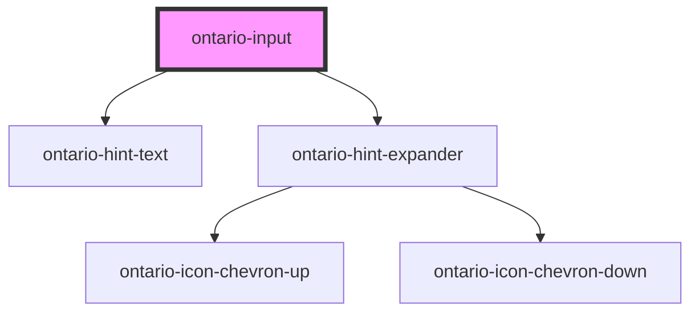

# ontario-input

Use a text input when you want the user to enter no more than a single line of information.

## Usage guidance

Please refer to the [Ontario Design System](https://designsystem.ontario.ca/components/detail/text-inputs.html) for current documentation guidance.

## Configuration

Once the component package has been installed (see Ontario Design System Component Library for installation instructions), the input component can be added directly into the project's code, and can be customized by updating the properties outlined [here](#properties). Additional information on custom types for header properties are outlined [here](#custom-property-types). Please see the [examples](#examples) below for how to configure the component.

## Examples

Example of a bare-bones input component, the `name` property is passed in for the input, which is used to reference form data after a form is submitted. The `caption` property is being provided, which will be displayed as the label. By default, the `inputWidth` will be `default`, the `type` will be `text`, and the input will be set to `optional`.

```html
<ontario-input
	name="ontario-text-input"
	caption="Ontario input"
/></ontario-input>
```

The following input component example has the `inputWidth` property passed in, which will define the width of the input field.

```html
<ontario-input
	name="ontario-text-input"
	caption='{
		"captionText": "Ontario input",
		"captionType": "large"
	}'
	input-width="10-char-width"
/></ontario-input>
```

## Custom property types

### caption

The `caption` property is used to render the label for the ontario-input. It can be passed either a string or an object. If no `captionType` needs to be specified, it can be passed as a string.

```html
caption='{ "captionText": "Input label", "captionType": "large" }'
```

| **Property name** | **Type**                           | **Description**                                                                                                                                  |
| ----------------- | ---------------------------------- | ------------------------------------------------------------------------------------------------------------------------------------------------ |
| `captionText`     | `string`                           | Text to display as the input question                                                                                                            |
| `captionType`     | `"default" \| "large"\| "heading"` | The type of label to display for the input question. This is optional, and if no information is provided, it will default to the `default` type. |

### hintExpander

The `hintExpander` property is used to include the Hint Expander component underneath the input label. This is passed in as an object with key-value pairs.

```html
hintExpander='{ "hint": "This is the hint expander title", "content": "This is the hint expander content - it is only
visible when the hint expander title (hint) is toggled" }'
```

| **Property name** | **Type** | **Description**                                                                                                 |
| ----------------- | -------- | --------------------------------------------------------------------------------------------------------------- |
| `hint`            | `string` | Text to display as the hint expander label/title. When toggled, it will display/hide the `hintExpander` content |
| `content`         | `string` | Text to display as the content of the hint expander                                                             |

## Accessibility

- An `id` attribute is necessary to allow the input to be associated with a label element
- A `name` attribute needs to be set to be submitted to the server when the form is submitted.

<!-- Auto Generated Below -->

## Properties

| Property         | Attribute       | Description                                                                                                                                                                                                                                 | Type                                                                                                                                        | Default     |
| ---------------- | --------------- | ------------------------------------------------------------------------------------------------------------------------------------------------------------------------------------------------------------------------------------------- | ------------------------------------------------------------------------------------------------------------------------------------------- | ----------- |
| `caption`        | `caption`       | The text to display as the input label                                                                                                                                                                                                      | `Caption \| string`                                                                                                                         | `undefined` |
| `customOnBlur`   | --              | Used to add a custom function to the textarea onBlur event.                                                                                                                                                                                 | `Function \| undefined`                                                                                                                     | `undefined` |
| `customOnChange` | --              | Used to add a custom function to the textarea onChange event.                                                                                                                                                                               | `Function \| undefined`                                                                                                                     | `undefined` |
| `customOnFocus`  | --              | Used to add a custom function to the textarea onFocus event.                                                                                                                                                                                | `Function \| undefined`                                                                                                                     | `undefined` |
| `elementId`      | `element-id`    | The unique identifier of the input. This is optional - if no ID is passed, one will be generated.                                                                                                                                           | `string \| undefined`                                                                                                                       | `undefined` |
| `hintExpander`   | `hint-expander` | Used to include the ontario-hint-expander component for the input component. This is passed in as an object with key-value pairs. This is optional.                                                                                         | `HintExpander \| string \| undefined`                                                                                                       | `undefined` |
| `hintText`       | `hint-text`     | Used to include the ontario-hint-text component for the input. This is optional.                                                                                                                                                            | `Hint \| string \| undefined`                                                                                                               | `undefined` |
| `inputWidth`     | `input-width`   | The width of the input field. If no value is assigned, it will present as the `default` input width.                                                                                                                                        | `"10-char-width" \| "2-char-width" \| "20-char-width" \| "3-char-width" \| "4-char-width" \| "5-char-width" \| "7-char-width" \| "default"` | `'default'` |
| `language`       | `language`      | The language of the component. This is used for translations, and is by default set through event listeners checking for a language property from the header. If no language is passed, it will default to English.                         | `"en" \| "fr" \| undefined`                                                                                                                 | `'en'`      |
| `name`           | `name`          | The name assigned to the input. The name value is used to reference form data after a form is submitted.                                                                                                                                    | `string`                                                                                                                                    | `undefined` |
| `required`       | `required`      | This is used to determine whether the input is required or not. This prop also gets passed to the InputCaption utility to display either an optional or required flag in the label. If no prop is set, it will default to false (optional). | `boolean \| undefined`                                                                                                                      | `false`     |
| `type`           | `type`          | The input type value. If no `type` is provided, it will default to 'text'.                                                                                                                                                                  | `"email" \| "password" \| "tel" \| "text"`                                                                                                  | `'text'`    |
| `value`          | `value`         | The input content value. This is optional.                                                                                                                                                                                                  | `string \| undefined`                                                                                                                       | `undefined` |

## Events

| Event           | Description                                                                         | Type               |
| --------------- | ----------------------------------------------------------------------------------- | ------------------ |
| `inputOnBlur`   | Emitted when a keyboard input event occurs when an input has lost focus.            | `CustomEvent<any>` |
| `inputOnChange` | Emitted when a keyboard input or mouse event occurs when an input has been changed. | `CustomEvent<any>` |
| `inputOnFocus`  | Emitted when a keyboard input event occurs when an input has gained focus.          | `CustomEvent<any>` |

## Dependencies

### Depends on

- [ontario-hint-text](../ontario-hint-text)
- [ontario-hint-expander](../ontario-hint-expander)

### Graph



---

_Built with [StencilJS](https://stenciljs.com/)_
