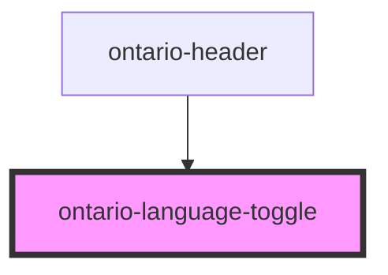

# ontario-language-toggle

This component is used internally to toggle the component languages, set translations and update the HTML lang attribute in the DOM.

It renders an anchor tag (styles as an ontario-button) that accepts either a URL prop to switch the language to, or a custom toggle function if additional functionality is necessary.

It is used in the ontario-header component.

<!-- Auto Generated Below -->

## Properties

| Property               | Attribute  | Description                                                                                         | Type                                | Default     |
| ---------------------- | ---------- | --------------------------------------------------------------------------------------------------- | ----------------------------------- | ----------- |
| `customLanguageToggle` | --         | A custom function to pass to the language toggle button. This is optional.                          | `Function \| undefined`             | `undefined` |
| `language`             | `language` |                                                                                                     | `string`                            | `undefined` |
| `size`                 | `size`     | The size of the language toggle button. If no prop is passed, it will be set to the `default` size. | `"default" \| "small" \| undefined` | `'default'` |
| `url`                  | `url`      | The URL to change to when the language toggle button is clicked. This is optional.                  | `string \| undefined`               | `undefined` |

## Events

| Event                   | Description                                                                                           | Type                  |
| ----------------------- | ----------------------------------------------------------------------------------------------------- | --------------------- |
| `headerLanguageToggled` | An event that emits to other components that the language toggle button has been toggled.             | `CustomEvent<string>` |
| `setAppLanguage`        | An event to set the Document's HTML lang property, and emit the toggled language to other components. | `CustomEvent<string>` |

## Dependencies

### Used by

- [ontario-header](../ontario-header)

### Graph

---

_Built with [StencilJS](https://stenciljs.com/)_
