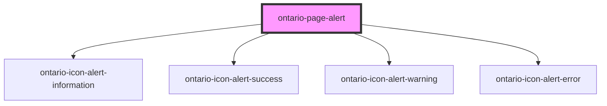

import { OntarioPageAlert } from '@ontario-lrc/ontario-design-system-component-library-react';

# ontario-page-alert

Use page alerts to notify users of important information or changes on a page. There are four types of page alerts (i.e informational, warning, success and error).

## Usage guidance

Please refer to the [Ontario Design System](https://designsystem.ontario.ca/components/detail/page-alerts.html) for current documentation guidance.

## Configuration

Once the component package has been installed (see Ontario Design System Component Library for installation instructions), the page alert component can be added directly into the project's code, and can be customized by updating the properties outlined [here](#properties). Please see the [examples](#examples) below for how to configure the component.

## Examples

Example of a page alert with no type passed. This will default to an "informational" page alert type.

```html
<ontario-page-alert heading="Licence plates">
	ServiceOntario centres may issue either a blue licence plate or a white embossed ‘Yours to Discover’ licence plate
	depending on availability.
	<a href="#">Learn more about replacing a licence plate</a>.
</ontario-page-alert>
```

<div>
	<OntarioPageAlert heading="Licence plates">
		ServiceOntario centres may issue either a blue licence plate or a white embossed ‘Yours to Discover’ licence plate
		depending on availability.
		<a href="#">Learn more about replacing a licence plate</a>.
	</OntarioPageAlert>
</div>

Example of success page alert type, where the content is passed as a string rather than as HTML.

```html
<ontario-page-alert
	type="success"
	heading="Your payment was successful and your order is now complete."
	content="Please look out for an email confirmation with your receipt and order number. Your licence plate sticker should arrive in 2-4 weeks."
></ontario-page-alert>
```

<div>
	<OntarioPageAlert
		type="success"
		heading="Your payment was successful and your order is now complete."
		content="Please look out for an email confirmation with your receipt and order number. Your licence plate sticker should arrive in 2-4 weeks.">
	</OntarioPageAlert>
</div>

<!-- Auto Generated Below -->

## Properties

| Property  | Attribute | Description                                                                                                                                                                                                   | Type                                                   | Default           |
| --------- | --------- | ------------------------------------------------------------------------------------------------------------------------------------------------------------------------------------------------------------- | ------------------------------------------------------ | ----------------- |
| `content` | `content` | The main content for the page alert. This can be rendered as either string or HTML content.                                                                                                                   | `string`                                               | `undefined`       |
| `heading` | `heading` | The heading for the page alert.                                                                                                                                                                               | `string`                                               | `undefined`       |
| `type`    | `type`    | The type of page alert to render. If no value is provided, the `informational` type alert would be rendered. There are four possible values for page alert: `informational`, `warning`, `success` or `error`. | `"error" \| "informational" \| "success" \| "warning"` | `'informational'` |

## Dependencies

### Depends on

- [ontario-icon-alert-information](../ontario-icon)
- [ontario-icon-alert-success](../ontario-icon)
- [ontario-icon-alert-warning](../ontario-icon)
- [ontario-icon-alert-error](../ontario-icon)

### Graph



---

_Built with [StencilJS](https://stenciljs.com/)_
