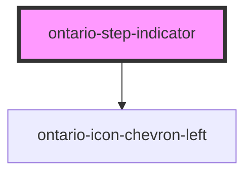

# ontario-step-indicator

<!-- Auto Generated Below -->

## Properties

| Property             | Attribute             | Description                                                                                                                                                                                                                                                                              | Type                        | Default     |
| -------------------- | --------------------- | ---------------------------------------------------------------------------------------------------------------------------------------------------------------------------------------------------------------------------------------------------------------------------------------- | --------------------------- | ----------- |
| `backButtonUrl`      | `back-button-url`     | URL for the back element to set a path for where the link will lead. If a URL is passed in, the back element will display as an anchor tag. The back element will require either the backButtonURL prop or the customOnClick prop to be passed in order for the back element to display. | `string \| undefined`       | `undefined` |
| `currentStep`        | `current-step`        | A number value to indicate which step the user is currently on.                                                                                                                                                                                                                          | `number \| undefined`       | `undefined` |
| `customOnClick`      | --                    | Used to add a custom function to the back button onClick event. If this function is passed in, the back element will display as a button. The back element will require either the backButtonURL prop or the customOnClick prop to be passed in order for the back element to display.   | `Function \| undefined`     | `undefined` |
| `language`           | `language`            | The language of the component. This is used for translations, and is by default set through event listeners checking for a language property from the header. If none are passed, it will default to English.                                                                            | `"en" \| "fr" \| undefined` | `'en'`      |
| `numberOfSteps`      | `number-of-steps`     | A number value to indicate to the user the total number of steps the form has.                                                                                                                                                                                                           | `number \| undefined`       | `undefined` |
| `percentageComplete` | `percentage-complete` | A number value to indicate to the user the percentage of the form that has been completed.                                                                                                                                                                                               | `number \| undefined`       | `undefined` |
| `showBackButton`     | `show-back-button`    | A boolean value to determine whether or not the back button is displayed for the step indicator. This is optional. If no prop is passed, it will default to `false`.                                                                                                                     | `boolean \| undefined`      | `false`     |

## Dependencies

### Depends on

- [ontario-icon-chevron-left](../ontario-icon)

### Graph

---

_Built with [StencilJS](https://stenciljs.com/)_
