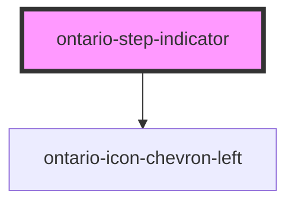

import { OntarioStepIndicator } from '@ontario-lrc/ontario-design-system-component-library-react';

# ontario-step-indicator

Use a step indicator to show a user’s progress as they move through a multi-step form.

## Usage guidance

Please refer to the [Ontario Design System](https://designsystem.ontario.ca/components/detail/step-indicator.html) for current documentation guidance.

## Configuration

Once the component package has been installed (see Ontario Design System Component Library for installation instructions), the step indicator component can be added directly into the project's code, and can be customized by updating the properties outlined [here](#properties). Please see the [examples](#examples) below for how to configure the component.

## Examples

### Percentage

<div>
	<OntarioStepIndicator
		show-back-button="true"
		back-button-url="https://designsystem.ontario.ca/"
		percentage-complete="70">
	</OntarioStepIndicator>
</div>

### Steps

<div>
	<OntarioStepIndicator
		show-back-button="true"
		back-button-url="https://designsystem.ontario.ca/"
		current-step="4"
		number-of-steps="5">
	</OntarioStepIndicator>
</div>

### No back button

<div>
	<OntarioStepIndicator
		show-back-button="false"
		current-step="4"
		number-of-steps="5">
	</OntarioStepIndicator>
</div>

### Enabling the back button

By default the step indicator doesn't display the back button. This can be enabled by setting `show-back-button` to `true`. See the code examples for how this is used.

### Progress reporting

Progress reported by the step indicator can be displayed in either a percentage or as the number of completed steps.

#### Using a percentage

To use a percentage as the reported progress, set the `percentage-complete` attribute to the percentage the user has completed the form.

```html
<ontario-step-indicator
	show-back-button="true"
	back-button-url="https://designsystem.ontario.ca/"
	percentage-complete="70"
></ontario-step-indicator>
```

#### Using steps

To output the step the user is currently on and the total number of steps, set the `current-step` and the `number-of-steps` to the appropriate values.

```html
<ontario-step-indicator
	show-back-button="true"
	back-button-url="https://designsystem.ontario.ca/"
	current-step="4"
	number-of-steps="5"
></ontario-step-indicator>
```

### Custom back button function

The simplest use of the back button is to provide, via the `back-button-url` attribute, a URL to navigate the user to when the back button is clicked. This isn't always sufficient to cover all use cases of the component so the component can also make use of a custom back button function, registered via the `customOnClick` property using JavaScript, to perform any custom actions within your application/site.

```html
<ontario-step-indicator show-back-button="true" percentage-complete="70"></ontario-step-indicator>

<script>
	function handleBackButton(event) {
		event.preventDefault();
		// Additional logic here
	}

	const ontarioStepIndicator = document.querySelector('ontario-step-indicator');
	ontarioStepIndicator.customOnClick = handleBackButton;
</script>
```

<!-- Auto Generated Below -->

## Properties

| Property             | Attribute             | Description                                                                                                                                                                                                                                                                              | Type                                    | Default     |
| -------------------- | --------------------- | ---------------------------------------------------------------------------------------------------------------------------------------------------------------------------------------------------------------------------------------------------------------------------------------- | --------------------------------------- | ----------- |
| `backButtonUrl`      | `back-button-url`     | URL for the back element to set a path for where the link will lead. If a URL is passed in, the back element will display as an anchor tag. The back element will require either the backButtonURL prop or the customOnClick prop to be passed in order for the back element to display. | `string \| undefined`                   | `undefined` |
| `currentStep`        | `current-step`        | A number value to indicate which step the user is currently on.                                                                                                                                                                                                                          | `number \| undefined`                   | `undefined` |
| `customOnClick`      | --                    | Used to add a custom function to the back button onClick event. If this function is passed in, the back element will display as a button. The back element will require either the backButtonURL prop or the customOnClick prop to be passed in order for the back element to display.   | `((event: Event) => void) \| undefined` | `undefined` |
| `language`           | `language`            | The language of the component. This is used for translations, and is by default set through event listeners checking for a language property from the header. If none are passed, it will default to English.                                                                            | `"en" \| "fr" \| undefined`             | `undefined` |
| `numberOfSteps`      | `number-of-steps`     | A number value to indicate to the user the total number of steps the form has.                                                                                                                                                                                                           | `number \| undefined`                   | `undefined` |
| `percentageComplete` | `percentage-complete` | A number value to indicate to the user the percentage of the form that has been completed.                                                                                                                                                                                               | `number \| undefined`                   | `undefined` |
| `showBackButton`     | `show-back-button`    | A boolean value to determine whether or not the back button is displayed for the step indicator. This is optional. If no prop is passed, it will default to `false`.                                                                                                                     | `boolean \| undefined`                  | `false`     |

## Dependencies

### Depends on

- [ontario-icon-chevron-left](../ontario-icon)

### Graph



---

_Built with [StencilJS](https://stenciljs.com/)_
