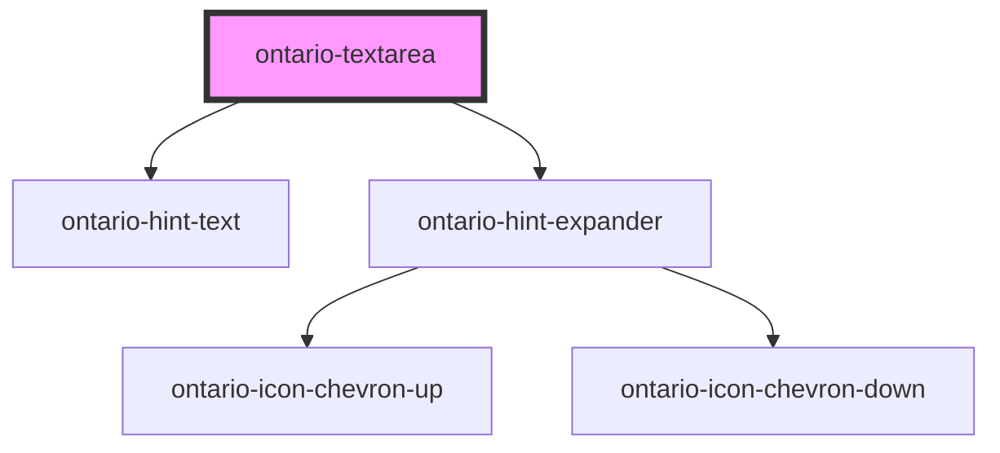

import { OntarioTextarea } from '@ontario-lrc/ontario-design-system-component-library-react';

# ontario-textarea

Use a text area when you want the user to enter **more than** a single line of information.

## Usage guidance

Please refer to the [Ontario Design System](https://designsystem.ontario.ca/components/detail/text-areas.html) for current documentation guidance.

## Configuration

Once the component package has been installed (see Ontario Design System Component Library for installation instructions), the textarea component can be added directly into the project's code, and can be customized by updating the properties outlined [here](#properties). Additional information on custom types for header properties are outlined [here](#custom-property-types). Please see the [examples](#examples) below for how to configure the component.

## Examples

Example of a bare-bones textarea component where the user is passing the `name` which is the value used to reference form data after a form is submitted. The `elementId` is also being passed in as the unique identifier of the textarea.

```html
<ontario-textarea caption="Comments" name="comments" element-id="form-comments"></ontario-textarea>
```

<OntarioTextarea caption="Comments" name="comments" element-id="form-comments"></OntarioTextarea>

To mark a textarea as required, add the `required` attribute to the component.

```html
<ontario-textarea
	caption="Comments"
	name="comments"
	element-id="form-comments"
	required="true"
	onBlur="exampleFunction()"
></ontario-textarea>
```

<OntarioTextarea caption="Comments" name="comments" element-id="form-comments" required="true"></OntarioTextarea>

### Forms

The `ontario-textarea` supports integration with native HTML `<form>` elements. This element integrates with the underlying browser form API and should work the same as a `<textarea>`.

```html
<form>
	<!-- Add an ontario-textarea -->
	<ontario-textarea name="textarea-1" caption="Text area"></ontario-textarea>

	<!-- Submit the form with a submit button -->
	<ontario-button type="primary" html-type="submit">Submit</ontario-button>
</form>
```

Remember to set the `name` attribute as this is used to identify the field when submitting the form.

## Custom property types

### caption

The `caption` property is used to render the legend for the ontario-textarea. It can be passed either a string or an object. If no `captionType` needs to be specified, it can be passed as a string.

```html
caption='{ "captionText": "Textarea label", "captionType": "default" }'
```

| Property name | Type                               | Default   | Description                                                                                                                                          |
| ------------- | ---------------------------------- | --------- | ---------------------------------------------------------------------------------------------------------------------------------------------------- |
| `captionText` | `string`                           |           | Text to display as the radio textarea question                                                                                                       |
| `captionType` | `"default" \| "large"\| "heading"` | `default` | The type of legend to display for the textarea question. This is optional, and if no information is provided, it will default to the `default` type. |

### hintExpander

The `hintExpander` property is used to include the Hint Expander component underneath the input label. This is passed in as an object with key-value pairs.

<!-- prettier-ignore -->
```html
hintExpander='{ "hint": "This is the hint expander title", "content": "This is the hint expander content - it is only visible when the hint expander title (hint) is toggled" }'
```

| Property name | Type     | Description                                                                                                     |
| ------------- | -------- | --------------------------------------------------------------------------------------------------------------- |
| `hint`        | `string` | Text to display as the hint expander label/title. When toggled, it will display/hide the `hintExpander` content |
| `content`     | `string` | Text to display as the content of the hint expander                                                             |

## Accessibility

- An `element-id` attribute is necessary to allow the textarea to be associated with a label element
- A `name` attribute needs to be set to be submitted to the server when the form is submitted.

<!-- Auto Generated Below -->

## Properties

| Property         | Attribute       | Description                                                                                                                                                                                                                                    | Type                                    | Default     |
| ---------------- | --------------- | ---------------------------------------------------------------------------------------------------------------------------------------------------------------------------------------------------------------------------------------------- | --------------------------------------- | ----------- |
| `caption`        | `caption`       | The text to display as the textarea label.                                                                                                                                                                                                     | `Caption \| string`                     | `undefined` |
| `customOnBlur`   | --              | Used to add a custom function to the textarea onBlur event.                                                                                                                                                                                    | `((event: Event) => void) \| undefined` | `undefined` |
| `customOnChange` | --              | Used to add a custom function to the textarea onChange event.                                                                                                                                                                                  | `((event: Event) => void) \| undefined` | `undefined` |
| `customOnFocus`  | --              | Used to add a custom function to the textarea onFocus event.                                                                                                                                                                                   | `((event: Event) => void) \| undefined` | `undefined` |
| `customOnInput`  | --              | Used to add a custom function to the textarea onInput event.                                                                                                                                                                                   | `((event: Event) => void) \| undefined` | `undefined` |
| `elementId`      | `element-id`    | The unique identifier of the textarea. This is optional - if no ID is passed, one will be generated.                                                                                                                                           | `string \| undefined`                   | `undefined` |
| `hintExpander`   | `hint-expander` | Used to include the ontario-hint-expander component for the textarea component. This is passed in as an object with key-value pairs. This is optional.                                                                                         | `HintExpander \| string \| undefined`   | `undefined` |
| `hintText`       | `hint-text`     | Used to include the ontario-hint-text component for the textarea. This is optional.                                                                                                                                                            | `Hint \| string \| undefined`           | `undefined` |
| `language`       | `language`      | The language of the component. This is used for translations, and is by default set through event listeners checking for a language property from the header. If no language is passed, it will default to English.                            | `"en" \| "fr" \| undefined`             | `undefined` |
| `name`           | `name`          | The name assigned to the textarea. The name value is used to reference form data after a form is submitted.                                                                                                                                    | `string`                                | `undefined` |
| `required`       | `required`      | This is used to determine whether the textarea is required or not. This prop also gets passed to the InputCaption utility to display either an optional or required flag in the label. If no prop is set, it will default to false (optional). | `boolean \| undefined`                  | `false`     |
| `value`          | `value`         | The textarea content value.                                                                                                                                                                                                                    | `string \| undefined`                   | `undefined` |

## Events

| Event           | Description                                                                         | Type                                                                        |
| --------------- | ----------------------------------------------------------------------------------- | --------------------------------------------------------------------------- |
| `inputOnBlur`   | Emitted when a keyboard input event occurs when an input has lost focus.            | `CustomEvent<InputInteractionEvent & { focused: boolean; }>`                |
| `inputOnChange` | Emitted when a keyboard input or mouse event occurs when an input has been changed. | `CustomEvent<{ id?: string \| undefined; value?: string \| undefined; }>`   |
| `inputOnFocus`  | Emitted when a keyboard input event occurs when an input has gained focus.          | `CustomEvent<InputInteractionEvent & { focused: boolean; }>`                |
| `inputOnInput`  | Emitted when a input event occurs when an input has been changed.                   | `CustomEvent<InputInteractionEvent & { inputType?: string \| undefined; }>` |

## Dependencies

### Depends on

- [ontario-hint-text](../ontario-hint-text)
- [ontario-hint-expander](../ontario-hint-expander)

### Graph



---

_Built with [StencilJS](https://stenciljs.com/)_
